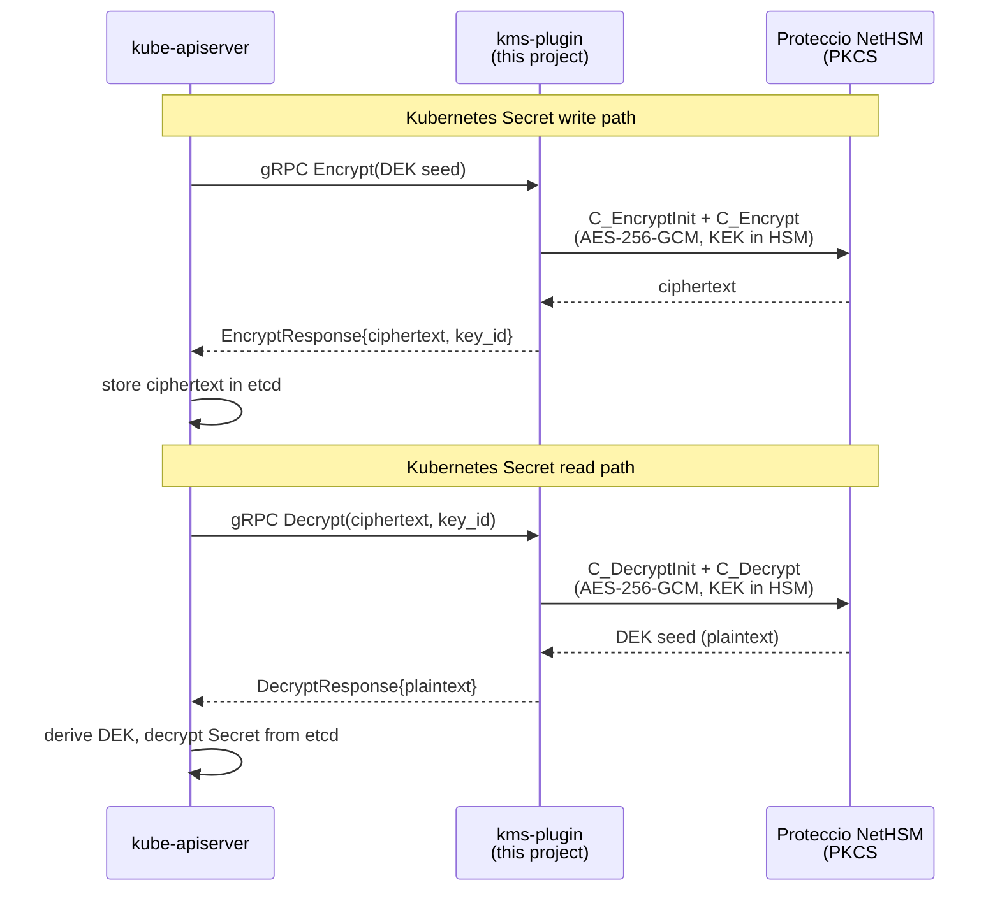

# Kubernetes KMS v2 Plugin for Proteccio HSMs

`eviden/k8s-hsm-kmsv2` is a [Kubernetes KMS v2](https://kubernetes.io/docs/tasks/administer-cluster/kms-provider/) plugin that encrypts Kubernetes Secrets at rest using a Hardware Security Module (HSM) via the PKCS#11 interface.

The **primary production target** is the [Proteccio NetHSM](https://eviden.com/solutions/digital-security/data-encryption/trustway-proteccio-nethsm/) from Eviden. [SoftHSMv2](https://github.com/softhsm/SoftHSMv2) is supported as a drop-in for local development and CI testing.

<!-- @import "[TOC]" {cmd="toc" depthFrom=1 depthTo=6 orderedList=false} -->

<!-- code_chunk_output -->

- [Kubernetes KMS v2 Plugin for Proteccio HSMs](#kubernetes-kms-v2-plugin-for-proteccio-hsms)
  - [How It Works](#how-it-works)
  - [Prerequisites](#prerequisites)
  - [Project Layout](#project-layout)
  - [Configuration Reference](#configuration-reference)
  - [Testing — minikube + SoftHSM2](#testing--minikube--softhsm2)
  - [Production Deployment — Proteccio NetHSM](#production-deployment--proteccio-nethsm)
  - [License](#license)

<!-- /code_chunk_output -->

## How It Works



**Envelope encryption model:**

1. The API server generates a fresh DEK seed and sends it to the plugin for wrapping.
2. The plugin calls the Proteccio HSM over PKCS#11 to encrypt the seed with an AES-256-GCM Key Encryption Key (KEK) that never leaves the HSM hardware.
3. The wrapped seed (`ciphertext`) and the stable `key_id` are returned and stored in etcd alongside the encrypted Secret.
4. On reads the process is reversed: the HSM decrypts the wrapped seed in hardware, the API server derives the DEK, and decrypts the Secret data.

The KEK is always in the HSM — key material is **never exposed to the plugin process or the Kubernetes control plane**.

## Prerequisites

| Requirement | Notes |
|-------------|-------|
| Linux x86_64 (production) | Required by the Proteccio `nethsm` client library |
| macOS/Linux arm64 / x86_64 (dev/CI) | Uses SoftHSMv2 |
| Go ≥ 1.22 | Build the plugin |
| GCC / C toolchain | `miekg/pkcs11` uses CGo to call `dlopen` |
| Proteccio `nethsm` library v3.17+ | `/lib/libnethsm.so` — production |
| SoftHSMv2 | Testing / CI only |
| minikube | Local E2E testing |

> **Note on CGo**: PKCS#11 is a C API specification. The Go binding
> ([github.com/miekg/pkcs11](https://github.com/miekg/pkcs11)) loads the HSM
> shared library at runtime via `dlopen`, which requires CGo. The rest of the
> codebase is pure Go.

## Project Layout

```text
cmd/kms-plugin/main.go              Entry point – flags, signal handling, gRPC server
pkg/hsm/provider.go                 PKCS#11 session, key management, AES-256-GCM ops
pkg/kms/service.go                  KMS v2 Service interface implementation
deploy/
  Dockerfile                        Multi-stage build – SoftHSM2 runtime (test)
  Dockerfile.proteccio              Multi-stage build – Proteccio runtime (production)
  encryption-config.yaml            API-server EncryptionConfiguration
  kms-plugin-pod.yaml               Static-pod manifest – SoftHSM2 (test)
  kms-plugin-pod-proteccio.yaml     Static-pod manifest – Proteccio (production)
scripts/
  setup-softhsm.sh                  Initialise a SoftHSM2 token for development / CI
  minikube-test.sh                  Bash E2E test on minikube (SoftHSM2)
  deploy-proteccio.sh               Bash production deployer (Proteccio)
  TEST-README.md                    Full test guide → see below
  PROD-README.md                    Full production guide → see below
  ansible/
    test/                           Ansible equivalent of minikube-test.sh
    prod/                           Ansible production deployer with Vault support
    README.md                       Ansible-specific usage guide
test/integration/
  integration_test.go               Go integration tests (run against SoftHSM2)
```

---

## Configuration Reference

| Flag | Env Var | Default | Description |
|------|---------|---------|-------------|
| `--pkcs11-lib` | `PKCS11_LIB` | — | Path to the PKCS#11 `.so` (e.g. `/lib/libnethsm.so`) |
| `--token-label` | `TOKEN_LABEL` | — | Token label to select the HSM slot |
| `--pin` | `PKCS11_PIN` | — | PKCS#11 user PIN (slot password) |
| `--slot-id` | — | `0` | Slot ID (when `--use-slot-id` is set) |
| `--use-slot-id` | — | `false` | Select slot by numeric ID instead of label |
| `--key-label` | `KEY_LABEL` | `k8s-kms-kek` | Label of the AES-256 KEK in the HSM |
| `--auto-create-key` | — | `false` | Generate KEK if not found in the HSM |
| `--socket` | `SOCKET_PATH` | `/run/kms-plugin/kms-plugin.sock` | UNIX socket path for the gRPC server |
| `--timeout` | — | `5s` | gRPC connection timeout |

---

## Testing — minikube + SoftHSM2

> **Full guide: [scripts/TEST-README.md](scripts/TEST-README.md)**

The integration test deploys the plugin on a local minikube cluster using SoftHSM2 as
a software-only PKCS#11 token — no HSM hardware required.  It verifies the full
encrypt → store → decrypt round trip.

Two equivalent approaches are available:

| | Quick start | Guide |
|---|---|---|
| **Pure Bash** | `./scripts/minikube-test.sh` | [TEST-README.md § Approach 1](scripts/TEST-README.md) |
| **Ansible** | `./scripts/ansible/test/run-test.sh` | [TEST-README.md § Approach 2](scripts/TEST-README.md) |

Both perform the same two-phase bootstrap: start minikube without encryption, deploy the
plugin and wait for its Unix socket, then patch the kube-apiserver manifest and wait for
recovery.  The Ansible variant adds idempotency and structured task output.

**Go unit / integration tests** (against a local SoftHSM2 token):

```bash
./scripts/setup-softhsm.sh          # initialise token
go test -v -count=1 ./test/integration/
```

---

## Production Deployment — Proteccio NetHSM

> **Full guide: [scripts/PROD-README.md](scripts/PROD-README.md)**

Production deployment bundles `libnethsm.so` (the Proteccio PKCS#11 library) into the
Docker image at build time.  The plugin runs as a static pod on each control-plane node,
sharing a Unix socket with `kube-apiserver` — the same pattern validated in the
minikube test.

Two equivalent deployment methods are available:

| | Quick start | Guide |
|---|---|---|
| **Pure Bash** | `./scripts/deploy-proteccio.sh` | [PROD-README.md § Approach 1](scripts/PROD-README.md) |
| **Ansible** | `cd scripts/ansible/prod && ansible-playbook …` | [PROD-README.md § Approach 2](scripts/PROD-README.md) |

Key differences between the two methods:

| Aspect | `deploy-proteccio.sh` | Ansible (`ansible/prod/`) |
|--------|----------------------|--------------------------|
| PIN handling | `USER_PIN` env var | Ansible Vault (encrypted at rest) |
| Node loop | Bash `for` loop, serial | `serial: 1` enforced by Ansible |
| Idempotency | Re-deploys everything | Tasks skip steps already done |
| Best for | Ad-hoc / small clusters | Production pipelines, regulated environments |

The [scripts/PROD-README.md](scripts/PROD-README.md) covers prerequisites, Proteccio
client file preparation, sequence diagrams for both methods, security considerations
(PIN storage, image supply-chain, mTLS), key rotation, etcd backup, and emergency
rollback.

---

## License

Business Source License 1.1 — see [LICENSE](LICENSE).

© 2026 Cosmian Tech SAS.
