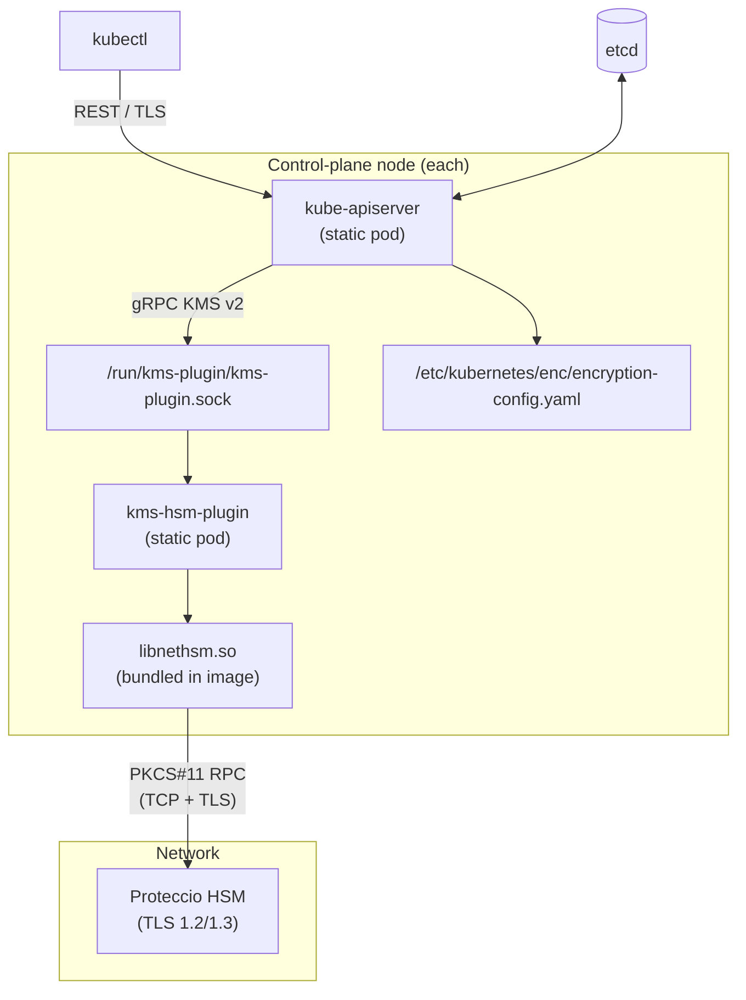
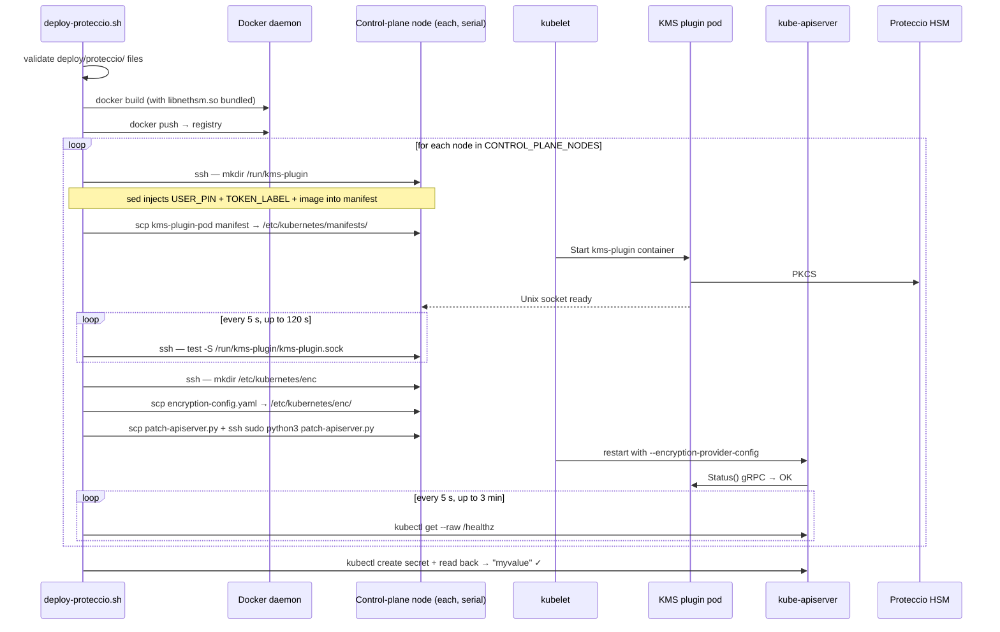
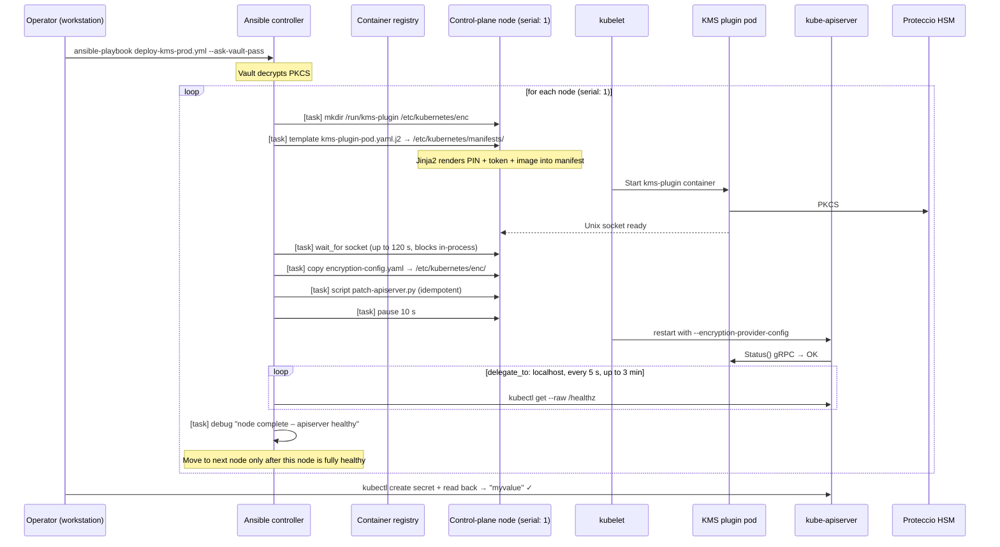

# Production Deployment — Proteccio HSM + KMS v2

## Overview

This guide describes how to deploy the KMS v2 HSM plugin against an **Eviden Proteccio** HSM on a production Kubernetes cluster.  The deployment:

- Targets a real kubeadm (or compatible) cluster with Kubernetes ≥ 1.29.
- Uses `libnethsm.so` — the Proteccio PKCS#11 network client library.
- Assumes the HSM is already provisioned and the PKCS#11 token exists.

Two equivalent deployment methods are provided.  Choose whichever fits your workflow:

| | `deploy-proteccio.sh` | Ansible (`ansible/prod/`) |
|---|---|---|
| **Style** | Pure Bash | Ansible playbook |
| **Node loop** | Serial, one at a time | `serial: 1` (enforced by Ansible) |
| **PIN storage** | Environment variable | Ansible Vault (encrypted at rest) |
| **Idempotency** | Manual checks | Built-in (`changed_when`, `wait_for`) |
| **Best for** | Ad-hoc or small clusters | Production pipelines, regulated environments |

---

<!-- @import "[TOC]" {cmd="toc" depthFrom=1 depthTo=6 orderedList=false} -->

<!-- code_chunk_output -->

- [Production Deployment — Proteccio HSM + KMS v2](#production-deployment--proteccio-hsm--kms-v2)
  - [Overview](#overview)
  - [Architecture](#architecture)
    - [Key Concepts](#key-concepts)
  - [Prerequisites](#prerequisites)
    - [Cluster](#cluster)
    - [Proteccio HSM](#proteccio-hsm)
    - [Build host](#build-host)
  - [Preparing Proteccio Client Files](#preparing-proteccio-client-files)
  - [Approach 1 — Pure Bash: `deploy-proteccio.sh`](#approach-1--pure-bash-deploy-protecciosh)
    - [Quick start](#quick-start)
    - [What it does](#what-it-does)
    - [Configuration variables](#configuration-variables)
  - [Approach 2 — Ansible: `ansible/prod/`](#approach-2--ansible-ansibleprod)
    - [Quick start](#quick-start-1)
    - [What it does](#what-it-does-1)
    - [Key differences from the Bash approach](#key-differences-from-the-bash-approach)
    - [Secrets management with Ansible Vault](#secrets-management-with-ansible-vault)
    - [Playbook configuration](#playbook-configuration)
  - [Security Considerations](#security-considerations)
    - [PIN storage](#pin-storage)
    - [Image supply-chain](#image-supply-chain)
    - [Mutual TLS to the HSM](#mutual-tls-to-the-hsm)
    - [RBAC / network policy](#rbac--network-policy)
  - [Key Rotation](#key-rotation)
  - [Backup and Recovery](#backup-and-recovery)
  - [Troubleshooting](#troubleshooting)
    - [Plugin fails to connect to HSM](#plugin-fails-to-connect-to-hsm)
    - [apiserver still restarting](#apiserver-still-restarting)
    - [Verify encrypted storage in etcd](#verify-encrypted-storage-in-etcd)
    - [Emergency rollback](#emergency-rollback)

<!-- /code_chunk_output -->

## Architecture



### Key Concepts

| Component | Role |
|-----------|------|
| **KEK** (Key Encryption Key) | AES-256 symmetric key stored in the HSM; never leaves the device |
| **DEK** (Data Encryption Key) | Per-secret random key generated by kube-apiserver; wrapped by the KEK |
| **Envelope** | `k8s:enc:kmsv2:v1:<keyID>:<wrapped-DEK>:<ciphertext>` stored in etcd |
| **keyID** | Opaque string returned by the plugin identifying which KEK was used |

---

## Prerequisites

### Cluster

- Kubernetes **≥ 1.29** (KMS v2 is stable from 1.29).
- `kubectl` configured against the target cluster.
- SSH access (with sudo) to all control-plane nodes.
- Python 3 available on every control-plane node (standard on modern Linux).

### Proteccio HSM

- Proteccio HSM operational and reachable from the control-plane nodes.
- A **PKCS#11 token** already initialised on the HSM (e.g. `HSM1-V1`).
- A **user PIN** with permissions to create and use AES-256 keys.
- (Optional) A pre-provisioned AES-256 KEK with label `k8s-kms-kek`.
  If the KEK does not exist yet, set `AUTO_CREATE_KEY=true` / `auto_create_key: true` on first deploy.

### Build host

- Docker installed.
- Proteccio client files staged in `deploy/proteccio/` (see below).

---

## Preparing Proteccio Client Files

The Proteccio PKCS#11 library and configuration must be bundled into the Docker image at
build time.  Copy them from a host that has the Proteccio client package installed:

```
deploy/proteccio/
├── libnethsm.so            # PKCS#11 shared library  (from /lib/libnethsm.so)
├── proteccio.rc            # Client configuration    (from /etc/proteccio/proteccio.rc)
└── proteccio.crt           # HSM TLS certificate     (from /etc/proteccio/proteccio.crt)
```

> **Never commit `proteccio_client.key` (private key) to git.**
> If mutual TLS is required, add `proteccio_client.crt` and `proteccio_client.key`
> outside of version control and uncomment the corresponding `COPY` lines in
> `deploy/Dockerfile.proteccio`.

```bash
mkdir -p deploy/proteccio
cp /lib/libnethsm.so                    deploy/proteccio/
cp /etc/proteccio/proteccio.rc          deploy/proteccio/
cp /etc/proteccio/proteccio.crt         deploy/proteccio/
```

Verify the HSM is reachable:

```bash
nethsmstatus
# Expected: Token state: 0X40 OPERATIONAL
```

---

## Approach 1 — Pure Bash: `deploy-proteccio.sh`

### Quick start

```bash
export REGISTRY=registry.example.com/myorg
export TOKEN_LABEL=HSM1-V1
export USER_PIN=<your-pin>
export CONTROL_PLANE_NODES="192.0.2.10 192.0.2.11 192.0.2.12"
export CONTROL_PLANE_SSH_USER=ubuntu
export CONTROL_PLANE_SSH_KEY=~/.ssh/my-key
export AUTO_CREATE_KEY=true          # first deploy only; set false afterwards

./scripts/deploy-proteccio.sh
```

### What it does

The script loops through `CONTROL_PLANE_NODES` **serially**, performing the same
sequence on each before moving to the next.



### Configuration variables

| Variable | Required | Default | Description |
|----------|----------|---------|-------------|
| `REGISTRY` | No | — | Docker registry prefix |
| `IMAGE_TAG` | No | `latest` | Image tag |
| `TOKEN_LABEL` | **Yes** | — | PKCS#11 token label on the Proteccio HSM |
| `USER_PIN` | **Yes** | — | PKCS#11 user PIN |
| `KMS_KEY_LABEL` | No | `k8s-kms-kek` | KEK label inside the token |
| `AUTO_CREATE_KEY` | No | `false` | Auto-provision the KEK (first deploy only) |
| `CONTROL_PLANE_NODES` | **Yes** | — | Space-separated node IPs/hostnames |
| `CONTROL_PLANE_SSH_USER` | No | `ubuntu` | SSH user |
| `CONTROL_PLANE_SSH_KEY` | No | `~/.ssh/id_rsa` | SSH private key path |

---

## Approach 2 — Ansible: `ansible/prod/`

### Quick start

```bash
# Prerequisites: ansible installed on the workstation
brew install ansible       # macOS
pip3 install ansible       # Linux

cd scripts/ansible/prod

# 1. Edit the inventory
vi hosts.ini                          # set correct IPs and SSH key

# 2. Edit non-sensitive config
vi group_vars/control_plane/vars.yml  # token_label, image_name, auto_create_key, ...

# 3. Create and encrypt the vault file with the real PIN
cp group_vars/control_plane/vault.yml.example \
   group_vars/control_plane/vault.yml
vi group_vars/control_plane/vault.yml  # replace "changeme" with the real PIN
ansible-vault encrypt group_vars/control_plane/vault.yml

# 4. Run the playbook
ansible-playbook -i hosts.ini deploy-kms-prod.yml --ask-vault-pass
```

### What it does

`serial: 1` in the playbook ensures Ansible processes **one control-plane node at a
time**, completing all tasks and waiting for apiserver recovery before touching the next
node.  This maintains cluster quorum throughout.



### Key differences from the Bash approach

| Aspect | `deploy-proteccio.sh` | Ansible playbook |
|--------|-----------------------|------------------|
| PIN handling | `USER_PIN` env var (visible in shell history) | Ansible Vault (encrypted file, decrypted in memory) |
| Manifest injection | `sed` on temp file | Jinja2 template (structured, type-safe) |
| Socket wait | SSH loop + `test -S` | `wait_for` module (blocks in-process, no SSH overhead) |
| apiserver healthcheck | kubectl loop in Bash | `command` module, `delegate_to: localhost` |
| Idempotency | Script re-deploys everything | Tasks skip steps already in the desired state |
| Error reporting | `set -e` exits on first failure | Structured task status with rescue/rollback hooks |

### Secrets management with Ansible Vault

The PKCS#11 user PIN is stored in an **encrypted** `vault.yml` file — it is never
committed in plain text.

```bash
# Encrypt
ansible-vault encrypt group_vars/control_plane/vault.yml

# View / edit without decrypting to disk
ansible-vault view  group_vars/control_plane/vault.yml
ansible-vault edit  group_vars/control_plane/vault.yml

# CI: pass vault password via file
ansible-playbook -i hosts.ini deploy-kms-prod.yml \
  --vault-password-file ~/.vault_pass
```

### Playbook configuration

**`group_vars/control_plane/vars.yml`** (committed to git):

| Variable | Default | Description |
|----------|---------|-------------|
| `token_label` | `HSM1-V1` | PKCS#11 token label on the Proteccio HSM |
| `kms_key_label` | `k8s-kms-kek` | AES-256 KEK label inside the token |
| `auto_create_key` | `false` | Set `true` on first deploy to auto-provision the KEK |
| `image_name` | `registry.example.com/…` | Fully-qualified image name |
| `kms_socket` | `/run/kms-plugin/kms-plugin.sock` | Unix socket path |

**`group_vars/control_plane/vault.yml`** (ansible-vault encrypted, never committed unencrypted):

| Variable | Description |
|----------|-------------|
| `vault_pkcs11_pin` | PKCS#11 user PIN for the Proteccio HSM |

---

## Security Considerations

### PIN storage

| Method | Risk |
|--------|------|
| `USER_PIN` env var (Bash) | Visible in process list, shell history, and CI logs unless explicitly masked |
| Ansible Vault (Ansible) | Decrypted in memory only; never written to disk in plaintext |

For either approach, the PIN also lives in the static pod manifest at
`/etc/kubernetes/manifests/kms-hsm-plugin.yaml` (readable by root only).  For stronger
protection consider sealing the PIN with a node TPM or a secrets manager.

### Image supply-chain

The Docker image bundles `libnethsm.so`.  Ensure the registry is private and image
digests are pinned in the static pod manifest to prevent substitution attacks.

### Mutual TLS to the HSM

Uncomment the `COPY` lines for client certificates in `deploy/Dockerfile.proteccio` and
enable `clientCert`/`clientKey` in `proteccio.rc` to authenticate the plugin host to
the HSM.

### RBAC / network policy

The KMS plugin pod runs with `hostNetwork: true` so it can reach the Proteccio HSM via
its TCP address.  Restrict outbound traffic with a firewall / network policy so only
the KMS plugin can initiate connections to the HSM TCP port (default **2224**).

---

## Key Rotation

KMS v2 supports online key rotation without restarting `kube-apiserver`.

1. Provision a new AES-256 key on the Proteccio HSM (e.g. label `k8s-kms-kek-v2`).
2. Update the plugin deployment (`--key-label=k8s-kms-kek-v2`) on every node.
   The plugin returns the new `keyID` in subsequent `EncryptResponse` messages.
3. Force re-encryption of all existing secrets:

   ```bash
   kubectl get secrets --all-namespaces -o json | kubectl replace -f -
   ```

4. Once all secrets use the new keyID, deactivate the old key on the HSM.

---

## Backup and Recovery

**Always backup etcd before enabling encryption.**  Secrets stored with a KEK that is
lost are **unrecoverable**.

Recommended practices:

- Enable HSM key backup/replication to a second Proteccio unit.
- Export a key backup (using HSM administrator tools) and store it offline in a vault.
- Snapshot etcd **before** the first deployment and **after** every key rotation.

```bash
ETCDCTL_API=3 etcdctl snapshot save /backup/etcd-$(date +%Y%m%d).db \
  --endpoints=https://127.0.0.1:2379 \
  --cacert=/etc/kubernetes/pki/etcd/ca.crt \
  --cert=/etc/kubernetes/pki/etcd/server.crt \
  --key=/etc/kubernetes/pki/etcd/server.key
```

---

## Troubleshooting

### Plugin fails to connect to HSM

```bash
ssh ubuntu@<node> "sudo crictl logs \$(sudo crictl ps --name kms-plugin -q)"
tail -f /var/log/proteccio.log   # on the node
nethsmstatus                     # verify HSM reachability
```

### apiserver still restarting

```bash
ssh ubuntu@<node> "sudo journalctl -u kubelet --since '5 minutes ago' | tail -40"
```

### Verify encrypted storage in etcd

```bash
ETCDCTL_API=3 etcdctl get /registry/secrets/default/kms-test-secret \
  --endpoints=https://127.0.0.1:2379 \
  --cacert=/etc/kubernetes/pki/etcd/ca.crt \
  --cert=/etc/kubernetes/pki/etcd/server.crt \
  --key=/etc/kubernetes/pki/etcd/server.key \
  | hexdump -C | head
```

The value should begin with the bytes for `k8s:enc:kmsv2:v1:` (not readable plaintext).

### Emergency rollback

1. Remove `--encryption-provider-config` from the apiserver manifest on each node.
2. Force-re-encrypt (or delete and recreate) all secrets so they are stored as plaintext.
3. Remove the KMS plugin pod from `/etc/kubernetes/manifests/`.

> **Warning:** After rollback, secrets that were never re-read remain encrypted in etcd
> and fail to decode until the KMS plugin is restored.  Perform rollback only in a
> maintenance window.
