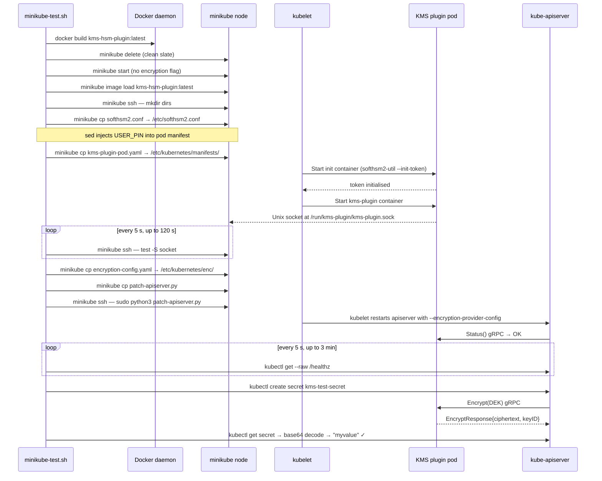
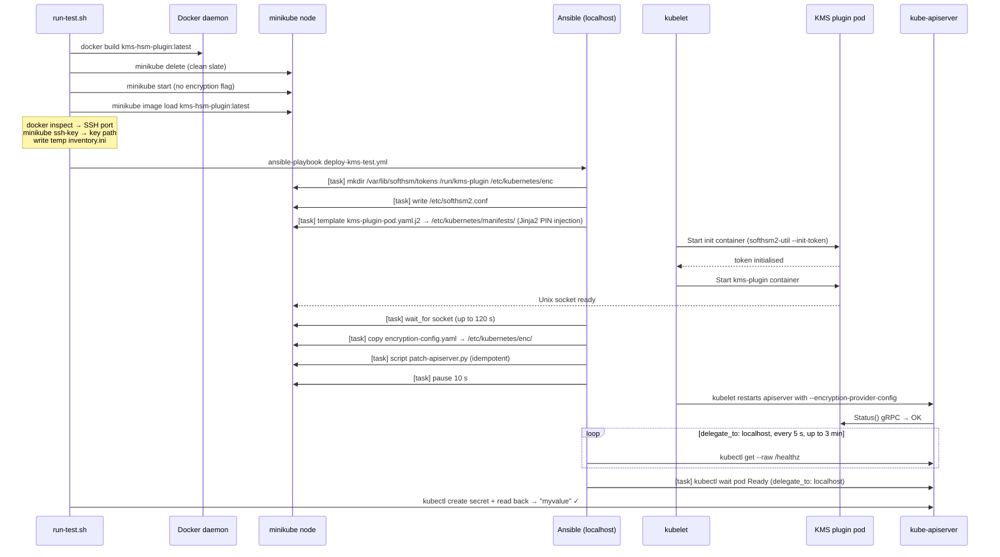
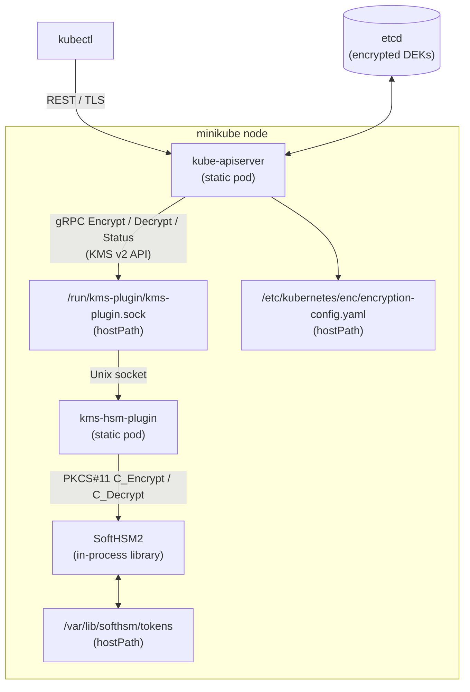
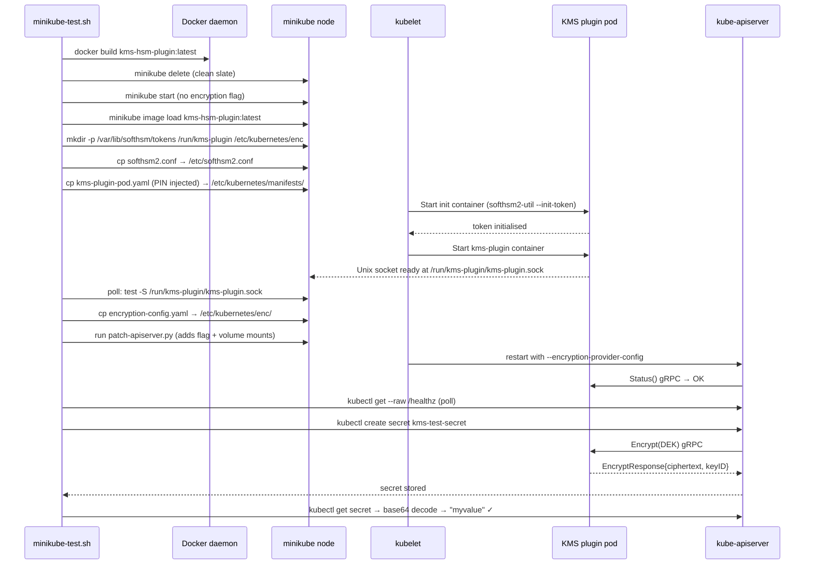

# Local Integration Test — SoftHSM2 + minikube

## Overview

The local integration test deploys the KMS v2 HSM plugin on a **minikube** cluster
using **SoftHSM2** (a software-only PKCS#11 token) — no real hardware required.  At
the end, a Kubernetes `Secret` is created and its value is read back to verify the
full encrypt → store → decrypt round trip through the plugin.

Two equivalent approaches are provided.  Choose whichever fits your workflow:

| | `minikube-test.sh` | `ansible/test/run-test.sh` |
|---|---|---|
| **Style** | Pure Bash | Bash wrapper + Ansible playbook |
| **Extra tools** | None beyond minikube/docker | `ansible` on the workstation |
| **Output** | Plain shell log | Structured Ansible task output |
| **Idempotency** | Full re-run from scratch each time | Tasks skip if already done |
| **Best for** | Quick local smoke test | CI pipelines, debugging individual tasks |

---

## Why the Two-Phase Bootstrap?

Kubernetes has a chicken-and-egg constraint with KMS providers:

- `kube-apiserver` must be given `--encryption-provider-config` **at start-up**; it
  cannot be changed at runtime without restarting the process.
- Before accepting that flag, the apiserver attempts a `Status()` gRPC call to the
  KMS plugin.  If the plugin socket does not exist yet the apiserver **crashes** and
  the node never becomes Ready.

Both scripts solve this by starting minikube **without** `--encryption-provider-config`,
deploying the plugin and waiting for its Unix socket, and only then patching the
`kube-apiserver.yaml` static-pod manifest so that kubelet restarts the apiserver with
encryption enabled.

---

## Approach 1 — Pure Bash: `minikube-test.sh`

### Quick start

```bash
# From the repository root:
./scripts/minikube-test.sh
```

### What it does



### PIN injection

Static pods cannot reference Kubernetes Secrets.  The `PKCS11_PIN` is injected at
deploy-time by `sed`, replacing the placeholder token in the pod manifest:

```bash
sed "s/PKCS11_PIN_PLACEHOLDER/$USER_PIN/g" deploy/kms-plugin-pod.yaml > /tmp/kms-pod.yaml
minikube cp /tmp/kms-pod.yaml /etc/kubernetes/manifests/kms-hsm-plugin.yaml
```

### Configuration variables

| Variable | Default | Description |
|----------|---------|-------------|
| `IMAGE_NAME` | `kms-hsm-plugin:latest` | Docker image tag |
| `MINIKUBE_PROFILE` | `k8s-hsm-kmsv2` | Isolated minikube profile |
| `TOKEN_LABEL` | `k8s-kms` | PKCS#11 token label in SoftHSM2 |
| `SO_PIN` | `12345678` | Security Officer PIN (init only) |
| `USER_PIN` | `1234` | User PIN injected into the pod manifest |
| `KMS_SOCKET` | `/run/kms-plugin/kms-plugin.sock` | Unix socket path |

---

## Approach 2 — Ansible: `ansible/test/run-test.sh`

### Quick start

```bash
# Prerequisites: ansible installed on the workstation
brew install ansible       # macOS
pip3 install ansible       # Linux

# From the repository root:
./scripts/ansible/test/run-test.sh
```

### What it does

The wrapper script handles the minikube lifecycle and generates an Ansible inventory;
the playbook handles everything on the node.



### Key differences from the Bash approach

| Aspect | `minikube-test.sh` | Ansible playbook |
|--------|---------------------|------------------|
| PIN injection | `sed` on a temp file | Jinja2 `{{ pkcs11_pin }}` in template |
| Socket wait | Bash `for` loop + `minikube ssh` | `wait_for` module (blocks in-process) |
| apiserver healthcheck | Bash `for` loop + `kubectl` | `command` module, `delegate_to: localhost` |
| Re-runs | Always deletes cluster first | Tasks are idempotent (skip if done) |
| Node access | `minikube ssh` / `minikube cp` | SSH via Ansible connection |

### Ansible inventory generation

minikube's Docker driver maps the node's SSH port (22) to a random host port on
`127.0.0.1`.  `run-test.sh` discovers this port at runtime:

```bash
_PORT=$(docker inspect k8s-hsm-kmsv2 | python3 -c \
  "import json,sys; c=json.load(sys.stdin)[0]; \
   print(c['NetworkSettings']['Ports']['22/tcp'][0]['HostPort'])")
```

A temporary `inventory.ini` is written and deleted on exit.

### Playbook variables

All configurable values are at the top of `ansible/test/deploy-kms-test.yml`:

| Variable | Default | Description |
|----------|---------|-------------|
| `image_name` | `kms-hsm-plugin:latest` | Docker image tag |
| `token_label` | `k8s-kms` | SoftHSM2 token label |
| `so_pin` | `12345678` | Security Officer PIN |
| `pkcs11_pin` | `1234` | User PIN (injected by Jinja2 template) |
| `kms_socket` | `/run/kms-plugin/kms-plugin.sock` | Unix socket path |
| `kubectl_context` | `k8s-hsm-kmsv2` | kubectl context for health/pod checks |

---

## Runtime Architecture (both approaches)



When a Secret is created:

1. apiserver generates a random 32-byte **Data Encryption Key (DEK)**.
2. It calls `Encrypt(DEK)` on the KMS plugin via gRPC over the Unix socket.
3. The plugin wraps the DEK with the **Key Encryption Key (KEK)** stored in SoftHSM2
   using AES-256-GCM (PKCS#11 `C_Encrypt`).
4. The wrapped DEK and the KEK's `keyID` are stored alongside the ciphertext in etcd
   as a `k8s:enc:kmsv2:v1:…` envelope.
5. Decryption is the reverse: `Decrypt(wrappedDEK)` → unwrapped DEK → plaintext.

---

## kube-apiserver Manifest Patching

Both approaches use the same `patch-apiserver.py` Python 3 stdlib script, which is
uploaded to the node and run as root.  It makes five idempotent edits to
`/etc/kubernetes/manifests/kube-apiserver.yaml`:

| Edit | What is added |
|------|---------------|
| 1 | `--encryption-provider-config=…` flag after `--tls-private-key-file` |
| 2 | `enc` volumeMount (read-only, `/etc/kubernetes/enc`) |
| 3 | `kms-socket` volumeMount (`/run/kms-plugin`) |
| 4 | `enc` hostPath volume |
| 5 | `kms-socket` hostPath volume |

kubelet detects the change and restarts `kube-apiserver`.  Both scripts then poll
`/healthz` until the apiserver is healthy again.

---

## Prerequisites

| Tool | Required by | Purpose |
|------|-------------|---------|
| `minikube` | both | Local Kubernetes node |
| `kubectl` | both | Cluster access |
| `docker` | both | Build the plugin image |
| `ansible` | Ansible approach only | Run the playbook |

No Go toolchain is required — the image is built inside Docker using a multi-stage build.

---

## Troubleshooting

**KMS socket never appears**

```bash
minikube ssh --profile k8s-hsm-kmsv2 -- \
  "sudo crictl logs \$(sudo crictl ps -a --name kms-plugin -q | head -1)"
```

Also check the init container:

```bash
kubectl --context k8s-hsm-kmsv2 describe pod kms-hsm-plugin -n kube-system
```

**apiserver does not recover after patch**

```bash
minikube ssh --profile k8s-hsm-kmsv2 -- \
  "sudo journalctl -u kubelet --since '5 minutes ago' | tail -40"
```

**Ansible can't connect to the minikube node**

```bash
# Verify port mapping
docker inspect k8s-hsm-kmsv2 | python3 -c \
  "import json,sys; c=json.load(sys.stdin)[0]; print(c['NetworkSettings']['Ports']['22/tcp'])"

# Test direct SSH
ssh -i $(minikube ssh-key --profile k8s-hsm-kmsv2) \
  -p <port> -o StrictHostKeyChecking=no docker@127.0.0.1 whoami
```

**Token already exists warning**

The init container is idempotent — it skips `--init-token` if the label already exists.
If SoftHSM2 token storage is stale, both scripts delete the cluster first so a fresh
nod is created with empty token storage.

Kubernetes has a chicken-and-egg constraint with KMS providers:

- `kube-apiserver` must be given `--encryption-provider-config` **at start-up**; it
  cannot be changed at runtime without restarting the process.
- Before `kube-apiserver` accepts that flag it will attempt a `Status()` gRPC call to
  the KMS plugin to prove the plugin is alive.  If the plugin socket does not exist yet,
  the apiserver **crashes** and the node never becomes Ready.

The script solves this by starting minikube **without** `--encryption-provider-config`,
then deploying the plugin and waiting for its Unix socket, and only then patching the
`kube-apiserver.yaml` static-pod manifest so that kubelet restarts the apiserver with
encryption enabled.

---

## Bootstrap Sequence



---

## Runtime Architecture


When a Secret is created:

1. apiserver generates a random 32-byte **Data Encryption Key (DEK)**.
2. It calls `Encrypt(DEK)` on the KMS plugin via gRPC over the Unix socket.
3. The plugin wraps the DEK with the **Key Encryption Key (KEK)** stored in SoftHSM2
   using AES-256-GCM (PKCS#11 `C_Encrypt` / `C_WrapKey`).
4. The wrapped DEK and the KEK's `keyID` are stored alongside the ciphertext in etcd
   as a `k8s:enc:kmsv2:v1:…` envelope.
5. Decryption is the reverse: `Decrypt(wrappedDEK)` → unwrapped DEK → plaintext.

---

## Prerequisites

| Tool        | Purpose                            |
|-------------|------------------------------------|
| `minikube`  | Local Kubernetes node              |
| `kubectl`   | Cluster access                     |
| `docker`    | Build the plugin image             |

No Go toolchain is required on the host — the image is built inside Docker using a
multi-stage build.

---

## Configuration Variables

| Variable        | Default                   | Description                                  |
|-----------------|---------------------------|----------------------------------------------|
| `IMAGE_NAME`    | `kms-hsm-plugin:latest`   | Docker image tag                             |
| `MINIKUBE_PROFILE` | `k8s-hsm-kmsv2`        | Isolated minikube profile (avoids polluting other clusters) |
| `TOKEN_LABEL`   | `k8s-kms`                 | PKCS#11 token label in SoftHSM2              |
| `SO_PIN`        | `12345678`                | Security Officer PIN (SoftHSM2 init only)    |
| `USER_PIN`      | `1234`                    | User PIN passed to the plugin via `PKCS11_PIN` env var |
| `KMS_SOCKET`    | `/run/kms-plugin/kms-plugin.sock` | Unix socket path shared between apiserver and plugin |

---

## PIN Injection

Static pods cannot reference Kubernetes Secrets.  The `PKCS11_PIN` is therefore injected
at deploy-time by `sed`:

```bash
sed "s/PKCS11_PIN_PLACEHOLDER/$USER_PIN/g" deploy/kms-plugin-pod.yaml > /tmp/kms-pod.yaml
minikube cp /tmp/kms-pod.yaml /etc/kubernetes/manifests/kms-hsm-plugin.yaml
```

The placeholder `PKCS11_PIN_PLACEHOLDER` in `deploy/kms-plugin-pod.yaml` is never
committed with a real PIN.

---

## kube-apiserver Manifest Patching

After the KMS socket appears, a small Python 3 stdlib script (`patch-apiserver.py`) is
uploaded to the node and run as root.  It makes five idempotent edits to
`/etc/kubernetes/manifests/kube-apiserver.yaml` using `re.sub`:

| Edit | What is added |
|------|---------------|
| 1 | `--encryption-provider-config=…` flag after `--tls-private-key-file` |
| 2 | `enc` volumeMount (read-only) |
| 3 | `kms-socket` volumeMount |
| 4 | `enc` hostPath volume |
| 5 | `kms-socket` hostPath volume |

kubelet detects the change automatically and restarts `kube-apiserver`; the script then
polls `/healthz` until the apiserver is healthy again.

---

## Troubleshooting

**KMS socket never appears**

```bash
minikube ssh --profile k8s-hsm-kmsv2 -- \
  "sudo crictl logs \$(sudo crictl ps -a --name kms-plugin -q | head -1)"
```

Also check the init container:

```bash
kubectl --context k8s-hsm-kmsv2 describe pod kms-hsm-plugin -n kube-system
```

**apiserver does not recover after patch**

```bash
minikube ssh --profile k8s-hsm-kmsv2 -- \
  "sudo journalctl -u kubelet --since '5 minutes ago' | tail -40"
```

**Token already exists warning**

The init container is idempotent — it skips `--init-token` if the label already exists.
If SoftHSM2 token storage is stale, `minikube delete` followed by a fresh run clears it.
